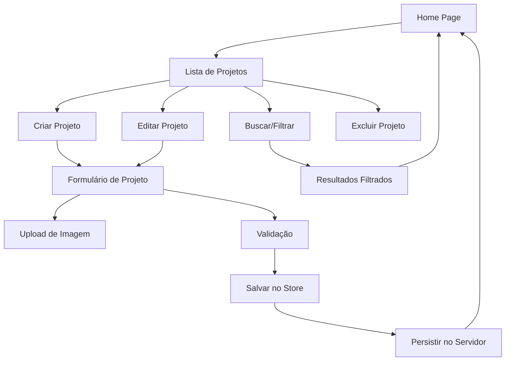

# Project Manager App

Um aplicativo completo de gerenciamento de projetos desenvolvido com Vue.js 3, TypeScript e Node.js, oferecendo duas versões de interface para diferentes experiências de usuário.

## Índice

- [Visão Geral](#visão-geral)
- [Requisitos Atendidos](#requisitos-atendidos)
- [Arquitetura](#arquitetura)
- [Justificativas Técnicas](#justificativas-técnicas)
- [Fluxo da Aplicação](#fluxo-da-aplicação)
- [Configuração do Ambiente](#configuração-do-ambiente)
- [Tecnologias Utilizadas](#tecnologias-utilizadas)
- [Testes](#testes)
- [Duas Versões de Cliente](#duas-versões-de-cliente)
- [Melhorias Futuras](#melhorias-futuras)
- [Observações](#observações)

## Visão Geral

O Project Manager App é uma aplicação web moderna para gerenciamento de projetos que permite criar, editar, visualizar e organizar projetos com informações detalhadas como cliente, datas de início e fim, imagens de capa e sistema de favoritos. A aplicação conta com funcionalidades avançadas de busca, filtros e validação progressiva de formulários.

## Requisitos Atendidos

- **CRUD Completo**: Criação, leitura, atualização e exclusão de projetos
- **Interface Responsiva**: Design adaptável para diferentes dispositivos
- **Upload de Imagens**: Sistema de upload e gerenciamento de imagens de capa
- **Sistema de Busca**: Busca em tempo real por nome e cliente
- **Filtros Avançados**: Filtro por favoritos e ordenação personalizada
- **Validação de Formulários**: Validação progressiva com feedback em tempo real
- **Persistência de Dados**: Armazenamento em JSON Server com API REST
- **Testes Unitários**: Cobertura de testes para componentes e composables
- **TypeScript**: Tipagem estática para maior confiabilidade
- **Gerenciamento de Estado**: Pinia para estado global reativo

## Arquitetura

### Estrutura do Projeto

```
project-manager-app/
├── client/                 # Cliente principal (versão refinada)
│   ├── src/
│   │   ├── components/     # Componentes Vue reutilizáveis
│   │   │   ├── icons/      # Ícones SVG customizados
│   │   │   ├── filters/    # Componentes de filtro
│   │   │   └── __tests__/  # Testes dos componentes
│   │   ├── composables/    # Lógica reutilizável (Composition API)
│   │   ├── services/       # APIs e serviços externos
│   │   ├── stores/         # Estado global (Pinia)
│   │   ├── types/          # Definições TypeScript
│   │   ├── views/          # Páginas da aplicação
│   │   └── router/         # Configuração de rotas
│   └── ...
├── client-v2/              # Cliente alternativo (design diferenciado)
├── server/                 # Backend Node.js
│   ├── imageServer.js      # Servidor de upload de imagens
│   ├── db.json            # Banco de dados JSON
│   └── uploads/           # Diretório de imagens
└── README.md
```

### Componentes Principais

#### Client (Versão Principal)

- **ProjectCard**: Componente modularizado em `ProjectImage`, `ProjectInfo` e `ProjectDate`
- **ProjectFormHeader**: Cabeçalho inteligente para formulários
- **ModalBase**: Sistema de modais reutilizável
- **SearchBar**: Busca com debounce e highlight
- **ProjectFilters**: Sistema completo de filtros

#### Client-v2 (Versão Alternativa)

- **Design Unificado**: Componentes mais consolidados
- **Interface Diferenciada**: Abordagem visual alternativa
- **Mesma Funcionalidade**: Mantém todas as features principais

## Justificativas Técnicas

### Fluxo de Validação Progressiva no Formulário

O sistema de validação implementado no `useProjectForm.ts` utiliza uma abordagem progressiva que oferece excelente experiência do usuário:

**Características Principais:**

1. **Validação Não-Intrusiva**: Inicialmente, o formulário não exibe erros até a primeira tentativa de submissão (`hasAttemptedSubmit`)

2. **Feedback Imediato**: Após a primeira submissão, os campos são validados em tempo real através de watchers Vue

3. **Validação Inteligente**:

   - Nome do projeto: Mínimo de 2 palavras
   - Cliente: Mínimo de 1 palavra
   - Datas: Validação de formato e lógica temporal

4. **Validação Cruzada**: O sistema verifica se a data final é posterior à data inicial automaticamente

**Benefícios:**

- Reduz ansiedade do usuário (não mostra erros prematuramente)
- Fornece feedback imediato após engajamento
- Previne submissões inválidas
- Melhora a taxa de conclusão de formulários

### Gradiente no Overlay do ProjectCard

- Melhorou a usabilidade e acessibilidade visual.
- Imagens de fundo claras poderiam dificultar a visualização dos botões.

### Uso de json-server e um servidor Node.js com Express no projeto

O projeto utiliza dois servidores diferentes para propósitos específicos:

- JSON Server (API Mock)
- Express Server (Servidor de Imagens)

O servidor Node.js com Express foi implementado para lidar com upload e manipulação de imagens, evitando o uso de base64 no banco de dados por motivos como:

- **Tamanho do banco**: Base64 aumenta significativamente o tamanho dos dados.
- **Performance**: Consultas e transferências mais lentas.
- **Cache**: Difícil para navegadores armazenarem em cache.
- **Requisições pesadas**: Dados em base64 aumentam o consumo de requisições.

Essa separação reflete uma abordagem mais próxima de um cenário real, onde imagens seriam gerenciadas por serviços de armazenamento especializados, como Amazon S3, Supabase Storage ou Cloudinary. Em produção, esses serviços oferecem escalabilidade, desempenho e facilidade de integração, enquanto no projeto atual o servidor Node.js simula essa funcionalidade de forma local para fins de desenvolvimento e testes.

O approach também reduziu dependências externas e custos adicionais para o ambiente atual.

## Fluxo da Aplicação



## Configuração do Ambiente

### Pré-requisitos

- Node.js 18+
- npm ou yarn

### Configuração das Variáveis de Ambiente

Crie um arquivo `.env` na raiz do projeto e copie as seguintes variáveis:

```env
VITE_API_PORT=3000
VITE_IMAGE_SERVER_PORT=3001
VITE_API_URL=http://localhost:3000
VITE_IMAGE_API_URL=http://localhost:3001/images
```

### Instalação e Execução

#### 1. Frontend (Cliente Principal)

```bash
cd client
npm install
npm run dev
```

**Porta:** http://localhost:5173

#### 2. Frontend Alternativo (Client-v2)

```bash
cd client-v2
npm install
npm run dev
```

**Porta:** http://localhost:5174

#### 3. Backend (Servidor JSON + Imagens)

**Terminal 1 - JSON Server:**

```bash
cd server
npm install
npm run json-server
```

**Porta:** http://localhost:3000

**Terminal 2 - Servidor de Imagens:**

```bash
cd server
node imageServer.js
```

**Porta:** http://localhost:3001

### Portas Utilizadas

| Serviço             | Porta | URL                   |
| ------------------- | ----- | --------------------- |
| Client (Principal)  | 5173  | http://localhost:5173 |
| Client-v2           | 5174  | http://localhost:5174 |
| JSON Server         | 3000  | http://localhost:3000 |
| Servidor de Imagens | 3001  | http://localhost:3001 |

## Tecnologias Utilizadas

### Frontend

- **Vue.js 3**: Framework progressivo com Composition API
- **TypeScript**: Tipagem estática para JavaScript
- **Pinia**: Gerenciamento de estado moderno para Vue
- **Vue Router**: Sistema de roteamento SPA
- **Tailwind CSS**: Framework CSS utility-first
- **Lodash**: Biblioteca de utilitários JavaScript
- **Vite**: Build tool e dev server ultra-rápido

### Backend

- **Node.js**: Runtime JavaScript
- **Express.js**: Framework web minimalista
- **JSON Server**: Mock de API REST
- **Multer**: Middleware para upload de arquivos
- **CORS**: Middleware para Cross-Origin Resource Sharing

### Ferramentas de Desenvolvimento

- **Vitest**: Framework de testes unitários
- **Vue Test Utils**: Utilitários para testes Vue
- **ESLint**: Linter para JavaScript/TypeScript
- **Prettier**: Formatador de código

## Testes

O projeto possui cobertura abrangente de testes unitários:

### Executar Testes

```bash
cd client  # ou client-v2
npm run test:unit
```

### Cobertura de Testes

- **Componentes**: Todos os componentes principais testados
- **Composables**: Lógica de negócio testada isoladamente
- **Store**: Estado e mutations testados
- **Utilitários**: Funções auxiliares cobertas

### Arquivos de Teste

- `components/__tests__/`: Testes de componentes Vue
- Testes de integração para fluxos completos
- Mocks para APIs externas

## Duas Versões de Cliente

### Por Que Duas Versões?

O projeto oferece duas implementações de frontend com justificativas sólidas:

#### **Client (Versão Principal)**

- **Arquitetura Modular**: Componentes altamente granulares
- **Manutenibilidade**: Separação clara de responsabilidades
- **Escalabilidade**: Facilita adição de novas funcionalidades
- **Exemplo**: `ProjectCard` dividido em `ProjectImage`, `ProjectInfo` e `ProjectDate`

#### **Client-v2 (Versão Alternativa)**

- **Performance**: Menos overhead de componentes
- **Simplicidade**: Abordagem mais direta
- **Design Diferenciado**: Exploração de alternativas visuais
- **Prototipagem Rápida**: Ideal para testes de conceito

### **Benefícios Estratégicos:**

1. **A/B Testing**: Permite comparar diferentes abordagens UX
2. **Flexibilidade de Design**: Equipes podem escolher a versão mais adequada
3. **Aprendizado**: Demonstra diferentes padrões arquiteturais
4. **Backup**: Redundância em caso de problemas críticos
5. **Especialização**: Cada versão pode atender públicos específicos

### **Casos de Uso:**

- **Client**: Projetos corporativos que precisam de alta manutenibilidade
- **Client-v2**: Protótipos e projetos que priorizam velocidade de desenvolvimento

## Melhorias Futuras

### Funcionalidades

- [ ] Autenticação e autorização de usuários
- [ ] Colaboração em tempo real
- [ ] Notificações push
- [ ] Relatórios e dashboards
- [ ] Integração com calendário
- [ ] API de terceiros (Slack, Trello)
- [ ] Sistema de comentários
- [ ] Versionamento de projetos

### Técnicas

- [ ] PWA (Progressive Web App)
- [ ] Internacionalização (i18n)
- [ ] Lazy loading de componentes
- [ ] Cache inteligente
- [ ] Otimização de imagens
- [ ] Docker para containerização
- [ ] CI/CD pipeline
- [ ] Monitoramento e analytics

### Performance

- [ ] Virtual scrolling para listas grandes
- [ ] Otimização de bundle size
- [ ] Service Workers
- [ ] CDN para assets estáticos

## Observações

### Desenvolvimento

- O projeto utiliza convenções modernas de Vue 3 com Composition API
- TypeScript garante type safety em todo o codebase
- Tailwind CSS oferece desenvolvimento rápido e consistente
- Estrutura modular facilita manutenção e extensibilidade

### Produção

- Para deploy em produção, executar `npm run build` em cada cliente
- Configurar variáveis de ambiente adequadas
- Considerar uso de proxy reverso (nginx) para servir múltiplos clientes
- Implementar backup regular do db.json

### Segurança

- O servidor de imagens possui validação de tipo de arquivo
- Limite de 5MB por upload de imagem
- CORS configurado para desenvolvimento (ajustar para produção)

---

**Desenvolvido com ❤️ usando Vue.js 3, TypeScript e Node.js**
